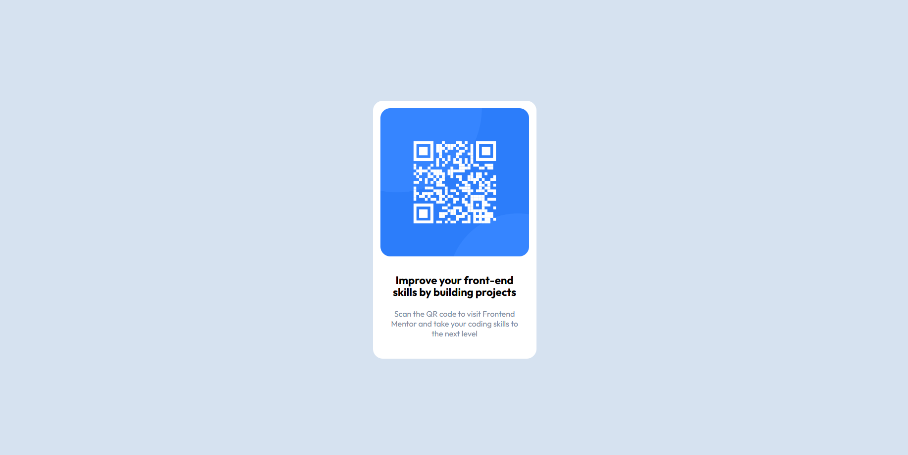

# Frontend Mentor - QR code component solution

This is a solution to the [QR code component challenge on Frontend Mentor](https://www.frontendmentor.io/challenges/qr-code-component-iux_sIO_H). Frontend Mentor challenges help you improve your coding skills by building realistic projects. 

## Table of contents

- [Overview](#overview)
  - [Screenshot](#screenshot)
  - [Links](#links)
- [My process](#my-process)
  - [Built with](#built-with)
- [Author](#author)

## Overview

### Screenshot

### Links

- Solution URL: (https://www.frontendmentor.io/solutions/simpley-qr-code-component-using-bem-css-methodology-KGxa3s31Gn)
- Live Site URL: (https://jacobwwarner-qr-code-component.netlify.app/)

## My process

### Built with

- Semantic HTML5 markup
- Block, Element, Modifier (BEM) CSS naming conventions
- Flexbox

## Author

- Website - [Jacob W. Warner](https://www.jacobwwarner.com)
- LinkedIn - [@jacobwwarner](https://www.linkedin.com/in/jacobwwarner)
- Frontend Mentor - [@jacobwwarner](https://www.frontendmentor.io/profile/jacobwwarner)
- X / Twitter - [@jacobwwarner](https://www.twitter.com/jacobwwarner)
